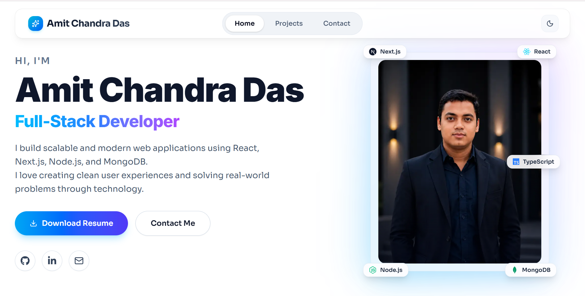
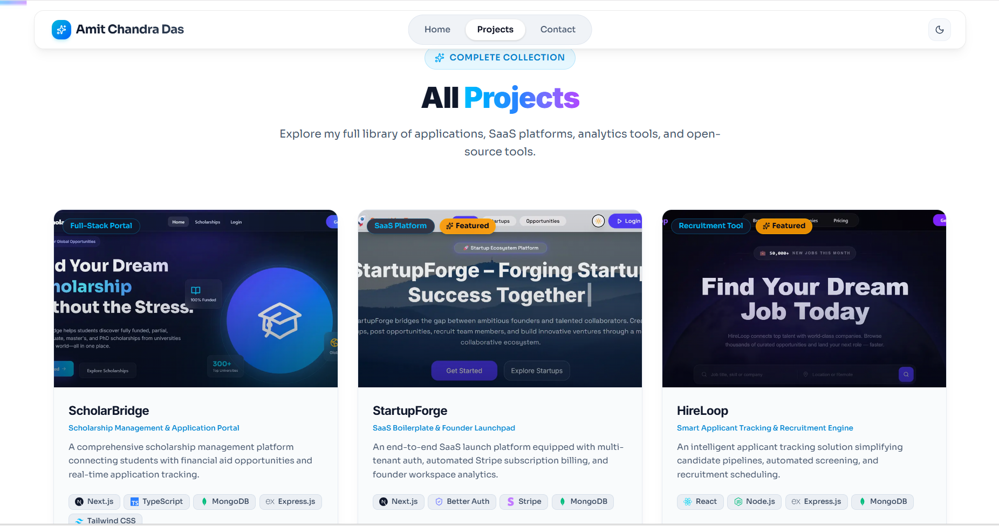
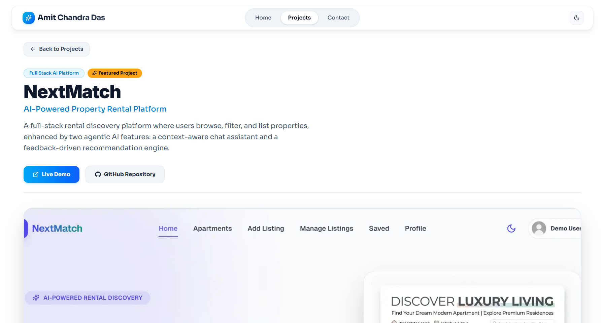
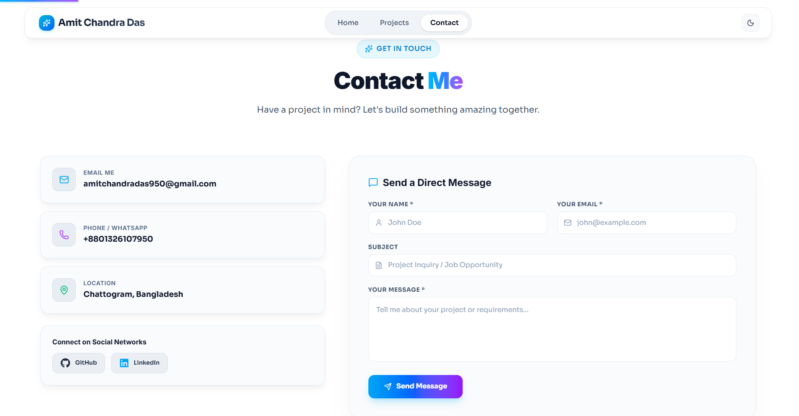

<div align="center">

# 🚀 Portfolio 2.0 — Developer Portfolio Website

**Modern Full Stack Developer Portfolio built with Next.js, TypeScript, and Tailwind CSS.**

[](https://amit-chandra-das-portfolio.vercel.app)
[](https://github.com/amitchandradas2004/Portfolio-2.0)
[](https://nextjs.org/)
[](https://www.typescriptlang.org/)
[](https://tailwindcss.com/)
[](LICENSE)

</div>

---

## 🖼️ Preview

Below are placeholder previews highlighting key sections of the portfolio:

| **Hero Section** | **Projects Showcase** |
| :---: | :---: |
|  |  |

| **Project Details Page** | **Contact & Email Form** |
| :---: | :---: |
|  |  |

---

## 📖 About The Project

**Portfolio 2.0** is a production-grade, highly performant personal developer portfolio website designed to present software engineering projects, technical skillsets, professional experience, academic background, and open-source contributions.

### 💡 Purpose & Why It Was Built
- **Professional Presence**: Provides recruiters, clients, and technical managers with a polished, interactive, and comprehensive platform to explore software projects and capabilities.
- **Modern Web Standards**: Built from the ground up utilizing the latest ecosystem standard—**Next.js (App Router)**, **React**, **TypeScript**, and **Tailwind CSS**.
- **Delightful User Experience**: Combines dynamic theme switching, fluid entrance animations, custom loading skeletons, and client-side page routing to create an engaging experience.

### 🎨 Design Philosophy
- **Glassmorphism Interface**: Multi-layered backdrop blurs, soft glowing accents, and translucent borders for a sleek modern aesthetic.
- **Responsive & Accessible**: Mobile-first architecture guaranteeing a seamless layout across mobile devices, tablets, and high-resolution monitors.
- **Performance-Oriented**: Minimal layout shifts, optimized font loading, fast dynamic routing, and smooth client-side state management.

---

## ✨ Features

### 🎨 Modern UI/UX
- **Glassmorphism Interface**: Stylized semi-transparent containers with subtle backdrop filters and border highlights.
- **Dark / Light Theme Support**: Integrated theme toggling with smooth transitions and system preference detection.
- **Animated UI Interactions**: Micro-interactions, hover effects, and entrance reveals powered by Framer Motion.
- **Responsive Design for All Devices**: Adaptive layout built to look great on desktop, tablet, and mobile displays.

### 💼 Portfolio Management & Content
- **Professional Hero Section**: Dynamic introduction section featuring resume access and quick call-to-action buttons.
- **About Me Section**: Overview of engineering background, domain interests, and career goals.
- **Skills Showcase**: Categorized skill pills and interactive technology icons.
- **Experience & Education Timeline**: Chronological records detailing work experience, achievements, degrees, and academic milestones.
- **Featured Projects & Dynamic Pages**: Homepage showcase with dedicated dynamic project detail pages (`/projects/[slug]`).
- **GitHub Contribution Activity Section**: Interactive open-source contribution calendar powered by `react-github-calendar`.
- **EmailJS Contact Form Integration**: Functional contact form enabling direct email transmission directly from the client.

### 🛠️ Developer Experience & Architecture
- **Type-Safe Development**: Full TypeScript integration for robust data structures and props validation.
- **Custom Loading State**: Custom loading screens (`loading.tsx`) and skeleton loaders (`ProjectCardSkeleton`, `ProjectsSkeleton`).
- **Custom 404 Page**: Polished `not-found.tsx` fallback page for invalid paths.
- **SEO Optimization**: Structured OpenGraph meta descriptions, dynamic page titles, and semantic HTML5 tags.

---

## 🛠️ Tech Stack

| Category | Technology | Description |
| :--- | :--- | :--- |
| **Frontend Framework** | [Next.js (App Router)](https://nextjs.org/) | React Framework for Production with App Router architecture |
| **Language** | [TypeScript](https://www.typescriptlang.org/) | Strongly typed programming language building on JavaScript |
| **UI Library** | [React](https://react.dev/) | Library for web and native user interfaces |
| **Styling** | [Tailwind CSS](https://tailwindcss.com/) | Utility-first CSS framework for rapid custom UI design |
| **Animation** | [Framer Motion](https://www.framer.com/motion/) | Production-ready motion & animation library for React |
| **Icons** | [Lucide React](https://lucide.dev/) & [React Icons](https://react-icons.github.io/react-icons/) | Clean icon sets for dynamic technology and navigation visuals |
| **Form Integration** | [EmailJS](https://www.emailjs.com/) | SDK for sending emails directly from client-side JavaScript |
| **GitHub Stats** | [React GitHub Calendar](https://github.com/grubersjoe/react-github-calendar) | Component displaying GitHub contribution history |
| **Tools** | [Git](https://git-scm.com/) & [GitHub](https://github.com/) | Version control system and open-source project hosting |
| **Deployment** | [Vercel](https://vercel.com/) | Hosting platform optimized for Next.js applications |

---

## 📐 Project Architecture

The project leverages Next.js App Router conventions to separate server and client-side concerns efficiently:

- **Component-Based Architecture**: Modular UI components located in `src/components/` for maximum reusability and clean maintainability.
- **App Router Structure**: Route handling using the Next.js `src/app/` hierarchy, incorporating route-level `loading.tsx` and custom `not-found.tsx` handlers.
- **Reusable UI Components**: Generic components like `ProjectCard`, `RenderTechIcon`, and `ProjectImageGallery` shared across pages.
- **Data-Driven Project Management**: Centralized data module (`src/lib/projectsData.ts`) decoupled from UI logic via fetcher utility functions (`getProjects`, `getFeaturedProjects`, `getProjectBySlug`).

---

## 📁 Folder Structure

Below is the directory tree of the Next.js project:

```
src/
├── app/                        # Next.js App Router routes & layouts
│   ├── api/                    # API endpoints
│   ├── contact/                # Contact page route (/contact)
│   │   └── page.tsx
│   ├── projects/               # Projects routes (/projects)
│   │   ├── [slug]/             # Dynamic project details route (/projects/:slug)
│   │   │   └── page.tsx
│   │   ├── loading.tsx         # Route loading boundary
│   │   └── page.tsx            # Projects listing page
│   ├── favicon.ico             # App favicon
│   ├── globals.css             # Global Tailwind styles & CSS utilities
│   ├── layout.tsx              # Root app layout (providers & metadata)
│   ├── loading.tsx             # Global loading UI
│   ├── not-found.tsx           # Custom 404 page
│   └── page.tsx                # Homepage / landing page
├── components/                 # Reusable UI & section components
│   ├── About.tsx               # About section
│   ├── Contact.tsx             # Contact section & EmailJS form
│   ├── Education.tsx           # Academic education section
│   ├── Experience.tsx          # Work experience section
│   ├── FeaturedProjects.tsx    # Homepage featured projects display
│   ├── Footer.tsx              # Footer component
│   ├── GithubContribution.tsx  # GitHub activity calendar component
│   ├── Hero.tsx                # Hero section
│   ├── Navbar.tsx              # Navigation header bar
│   ├── ProjectCard.tsx         # Project card component
│   ├── ProjectCardSkeleton.tsx # Card skeleton component
│   ├── ProjectImageGallery.tsx # Image carousel/gallery component
│   ├── Projects.tsx            # Projects listing layout
│   ├── ProjectsSkeleton.tsx    # Grid skeleton loader component
│   ├── RenderTechIcon.tsx      # Dynamic technology icon resolver
│   ├── ScrollProgress.tsx      # Scroll progress bar
│   ├── Skills.tsx              # Skills grid component
│   └── ThemeProvider.tsx       # Theme provider wrapper component
└── lib/                        # Business logic & static datasets
    ├── email.ts                # EmailJS integration utilities
    ├── getFeaturedProjects.ts  # Featured project retriever
    ├── getProjectBySlug.ts     # Project by slug retriever
    ├── getProjects.ts          # All projects retriever
    └── projectsData.ts         # Central project data store
```

---

## 🚀 Getting Started

Follow these instructions to get a local development environment running.

### Prerequisites

Make sure you have the following installed on your local machine:
- **Node.js**: `v18.17.0` or higher
- **npm**: `v9.0.0` or higher (included with Node.js)

Verify your Node version:
```bash
node -v
npm -v
```

### Installation & Setup

1. **Clone the Repository**
   ```bash
   git clone https://github.com/amitchandradas2004/Portfolio-2.0.git
   cd portfolio-2.0
   ```

2. **Install Dependencies**
   ```bash
   npm install
   ```

3. **Configure Environment Variables**
   Create a `.env.local` file in the root of the project to enable EmailJS contact form functionality:
   ```env
   NEXT_PUBLIC_EMAILJS_SERVICE_ID=your_service_id
   NEXT_PUBLIC_EMAILJS_TEMPLATE_ID=your_template_id
   NEXT_PUBLIC_EMAILJS_PUBLIC_KEY=your_public_key
   ```

4. **Start Development Server**
   ```bash
   npm run dev
   ```

5. **View Application**
   Open your browser and navigate to `http://localhost:3000` to view the running portfolio.

---

## 📜 Available Scripts

| Command | Description |
| :--- | :--- |
| `npm run dev` | Launches local development server at `http://localhost:3000` |
| `npm run build` | Builds the production bundle |
| `npm run start` | Starts the production build server |
| `npm run lint` | Runs ESLint to check for code quality and formatting errors |

---

## 📄 License

This project is licensed under the [MIT License](LICENSE) - see the LICENSE file for details.